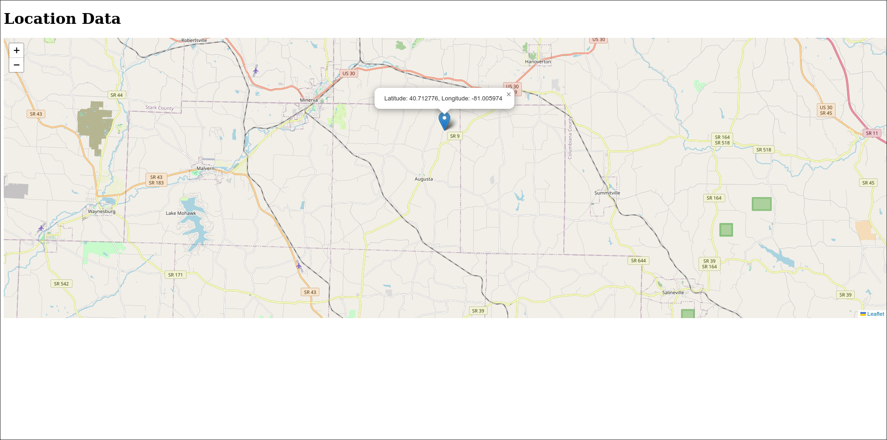

# Intro

Docker container for your home server, shell script for your clients. Geoclue2 can be extremely accurate with WiFi-based location tracking (20m range).

# Basics 
1. Clone the repository onto your server
2. Adjust values in .env and docker-compose.yml, if desired. You should probably add your network/proxy configuration now.
3. `docker compose build`
4. `docker compose up -d` (may need to restart web container once)
6. Install geoclue on client computer
7. Download the ClientPOST.sh script and `chmod +x` it. You may need to switch ([guide](https://konstantintutsch.com/blog/beacondb-geolocation-on-linux-gnome)) the wifi provier to beacondb in `/etc/geoclue/geoclue.conf` now that Mozilla Location Services has closed. Consider contributing to the [beacondb project](https://beacondb.net/) with nearby device information. Google Maps API is another option, but seems like it's paid after a certain number of requests each month. 
8. Execute the script (preferably, with a cron job) to send location data to server


Test your server configuration is working with the following command:
```bash
curl -X POST https://geo.example.com/location \
     -H "Content-Type: application/json" \
     -d '{
           "latitude": "20.123456",
           "longitude": "-20.123456",
           "accuracy": "20.0",
           "speed": "0.5",
           "heading": "180.0",
           "timestamp": "2024-09-20 21:22:23"
         }'
```

# WebUI Picture


